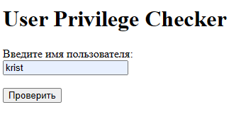

## Тестовое задание
Необходимо написать простое web-приложение с использованием node.js node-addon-api (C ) WinAPI для проверки привилегии пользователя (например, Администратор/Пользователь/Гость) в списке пользователей операционной системы Windows.
### Приложение работает по следующему сценарию:
1. Пользователь запускает web-сервер из корня проекта: server.bat
2. Автоматически открывается браузер с начальной web страницей, на которой отображаются - поле ввода имени пользователя - кнопка "Проверить"
3. Пользователь вводит любое имя пользователя и нажимает на "проверить" 

   
   
4. Если введённый пользователь в списке пользователей имеет привилегию Администратор/Пользователь/Гость, отображается страница с надписью "<имя_введённого_пользователя> имеет привелегию <привилегия>"

   

   

   

5. Если введённого пользователя нет в списке пользователей, отображается страница с надписью "<имя_введённого_пользователя> нет такого пользователя"

   

6. Под надписью есть кнопка "Назад", при нажатии на которую происходит возврат на начальную страницу
7. Проверка привилегий осуществляется через WinAPI.
